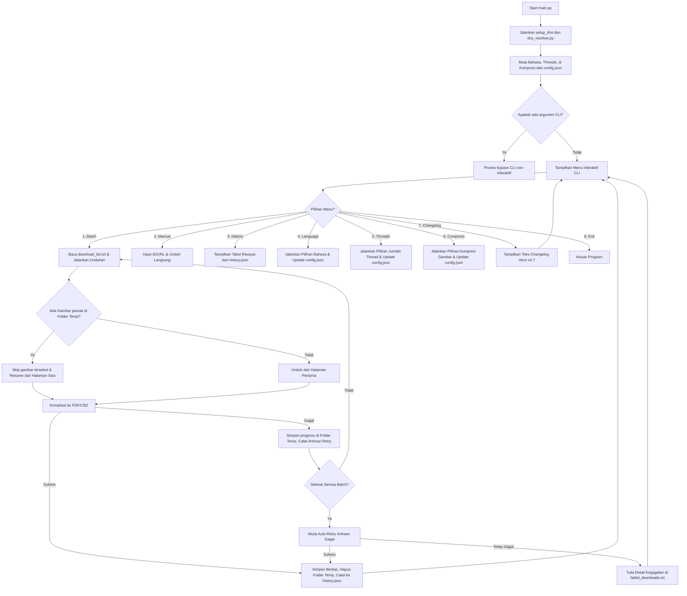

# Product Requirement Document (PRD): Batch PDF & CBZ Downloader nHentai

Dokumen ini berisi spesifikasi kebutuhan produk, arsitektur, dan detail implementasi aplikasi pengunduh manga/doujinshi dari nHentai ke format PDF/CBZ secara massal (batch) dengan bypass pemblokiran DNS, sistem lokalisasi multi-bahasa, pengunduhan paralel multi-thread berkecepatan tinggi, kompresi gambar pintar, serta pemulihan unduhan pasca-crash (resumable).

---

## 1. Tujuan Produk (Product Goals)
- Mempermudah pengguna untuk mengunduh banyak manga sekaligus dari nHentai dalam sekali jalan (batch).
- Mengonversi otomatis halaman gambar manga yang diunduh ke dalam format satu file PDF utuh atau arsip komik CBZ yang siap dibaca.
- Mengatasi pemblokiran situs oleh ISP lokal (seperti Internet Positif di Indonesia) secara terprogram menggunakan DNS-over-HTTPS (DoH) fallback langsung dari kode Python tanpa memerlukan VPN tambahan di sistem operasi.
- Menyediakan antarmuka interaktif CLI terpadu yang ramah pengguna dengan dukungan multi-bahasa (Inggris, Indonesia, Mandarin, Jepang).
- Mencegah unduhan ulang halaman yang sudah selesai jika proses terhenti di tengah jalan (Crash Session Recovery).
- Mengoptimalkan ruang penyimpanan dengan kompresi gambar pintar (lossless PNG & lossy JPEG) tanpa merusak ketajaman visual.
- Memungkinkan pengguna untuk meninjau riwayat pembaruan fitur proyek versi v0.7 secara lokal di CLI.

---

## 2. Fitur & Fungsionalitas Utama

### A. Batch Downloader via `download_list.txt`
- Membaca daftar ID manga atau URL lengkap dari file teks `download_list.txt`.
- Memproses setiap baris secara sekuensial. Baris kosong atau yang diawali dengan tanda pagar `#` (sebagai komentar) akan diabaikan.
- Menyediakan deteksi unduhan ganda (Smart Skip): Melewati unduhan jika file hasil akhir `[ID] Title.pdf` atau `[ID] Title.cbz` sudah ada di folder `downloads/`.

### B. Konversi Halaman ke PDF atau CBZ
- **PDF**: Mengompilasi seluruh gambar yang diunduh ke dalam satu file PDF tunggal menggunakan pustaka `img2pdf` secara lossless (tanpa kompresi ulang/penurunan kualitas).
- **CBZ**: Mengompilasi gambar ke dalam bentuk arsip ZIP standar dengan ekstensi renamed `.cbz` (Comic Book Zip) menggunakan pustaka bawaan `zipfile`.
- Menyimpan hasil akhir di folder `downloads/` dengan format penamaan baru: **`[ID] Title.ext`** (tanpa underscore pemisah setelah ID).

### C. Mode Interaktif CLI & Multi-Bahasa
- Menyediakan layar konfigurasi bahasa saat pertama kali diluncurkan (secara default diset otomatis ke bahasa Inggris) dan dapat diubah sewaktu-waktu dari menu utama.
- Mendukung empat bahasa lokalisasi:
  1. **Inggris (Default)**
  2. **Indonesia**
  3. **Cina (中文)**
  4. **Jepang (日本語)**
- Menu navigasi interaktif utama memiliki **8** opsi navigasi yang divalidasi dengan prompt pilihan dinamis (1-8):
  1. *Run batch downloads from download_list.txt* (Menjalankan antrean massal)
  2. *Manual download* (Mengunduh komik tunggal secara interaktif lewat input ID/URL)
  3. *View download history* (Melihat tabel riwayat unduhan secara rapi di konsol)
  4. *Change language* (Mengubah preferensi bahasa)
  5. *Change thread count* (Mengonfigurasi jumlah thread unduhan)
  6. *Toggle image compression* (Mengonfigurasi pengaktifan kompresi gambar pintar)
  7. *View changelog* (Melihat daftar riwayat pembaruan proyek versi v0.7)
  8. *Exit* (Keluar)
- Graceful Exit: Menangani interupsi keyboard (`Ctrl+C`) dan penutupan aliran input standard (`EOFError` / `Ctrl+D`) secara global tanpa memicu Python traceback crash di terminal IDE.

### D. Riwayat Unduhan (History Tracker)
- Mencatat metadata komik yang berhasil diunduh ke file `history.json` yang menyimpan data: `id`, `title`, `format`, `pages`, `file_size_bytes`, dan `download_date`.
- Dilengkapi dengan pengaman validasi tipe data (type guard) untuk mereset dan memulihkan berkas riwayat secara otomatis jika terdeteksi kerusakan format JSON.

### E. Pemulihan Pasca-Crash (Crash Session Recovery) & Page Ordering
- Folder gambar sementara `temp_[ID]` **tidak dihapus** jika proses unduh mengalami kegagalan, mati koneksi, atau dihentikan paksa (`Ctrl+C`).
- Saat komik tersebut diunduh kembali, program akan memindai folder `temp_[ID]`, memverifikasi integritas gambar yang sudah terunduh (> 100 bytes), melompati halaman tersebut, dan langsung melanjutkan unduhan dari halaman yang tersisa (*resume download*).
- **Optimasi Recovery**: Melewati pemanggilan kompresi gambar ulang pada berkas cache yang sudah ada untuk menghindari degradasi kualitas bertingkat (double-compression) dan menghemat pemakaian CPU.
- **Penyusunan Halaman Numerik**: Menggunakan pengurutan berbasis angka (numeric page sorting) alih-alih leksikografis biasa agar file kompilasi tidak mengalami malafungsi susunan halaman (misalnya halaman `1000` tersisip sebelum `101` pada galeri berukuran masif).
- Menampilkan bilah kemajuan `tqdm` yang dikelola secara aman dengan `with` context manager untuk memastikan stabilitas rendering dan menutup visual terminal cursor dengan rapi pasca proses selesai.

### F. Auto-Retry Queue & Pencatatan Error
- **Auto-Retry**: Melakukan percobaan ulang (retry) otomatis sebanyak 3 kali dengan jeda waktu yang terus bertambah (exponential backoff) per halaman.
- **Auto-Retry Antrean Gagal**: Mengumpulkan semua ID manga yang gagal diunduh selama proses batch berjalan, lalu secara otomatis mencoba mengunduhnya kembali satu kali lagi di akhir sesi sebelum melaporkan kegagalan permanen ke file `failed_downloads.txt`.

### G. Bypass Blokir DNS (DoH Fallback)
- Melakukan monkey-patching pada fungsi resolusi host internal Python (`socket.getaddrinfo`).
- Mengalihkan kueri DNS untuk domain `nhentai.net` and `i.nhentai.net` secara langsung ke resolver DNS-over-HTTPS (DoH) dengan fallback bertingkat: **Cloudflare DoH -> Google DoH -> AdGuard DoH -> System DNS**.
- **Keamanan Threading (Locking)**: Membungkus pencarian DoH menggunakan `threading.Lock` global untuk menghindari duplikasi pemanggilan API DoH secara simultan saat thread paralel diaktifkan.

### H. Riwayat Pembaruan Proyek (Changelog Viewer)
- Menampilkan ringkasan daftar fitur baru versi `v0.7` secara visual di dalam konsol terminal dengan dukungan lokalisasi multi-bahasa.

### I. Multi-threaded Download (High Speed)
- Menggunakan `ThreadPoolExecutor` untuk mengunduh banyak halaman gambar manga secara paralel.
- Jumlah thread dapat diatur secara interaktif melalui menu (pilihan 1 sampai 32) atau melalui argumen baris perintah `--threads`.
- Default diatur ke 4 thread untuk kinerja optimal tanpa mengorbankan stabilitas bandwidth.

### J. Smart Image Compression (Kompresi Gambar Pintar)
- Menggunakan pustaka `Pillow` untuk mengompresi gambar halaman komik yang diunduh sebelum dibungkus ke PDF/CBZ.
- **Dukungan Format Pintar**:
  - Jika gambar bertipe **JPEG**, kompresi lossy dilakukan dengan konfigurasi kualitas (`quality`) 1-100 (bawaan: 85) serta pengoptimalan huffman (`optimize=True`).
  - Jika gambar bertipe **PNG**, kompresi lossless dilakukan dengan kompresi teroptimasi (`optimize=True`).
  - Jika gambar bertipe **WEBP**, kompresi dilakukan dengan mempertahankan format aslinya secara terkompresi.
- **RGBA/Transparency Blending**: Menangani gambar bertransparansi (`RGBA`, `LA`, atau `P` transparan) secara aman dengan menempelkannya pada latar belakang putih solid (`RGB`) sebelum dikonversi ke JPEG guna menghindari kegagalan simpan `cannot write mode RGBA as JPEG`.
- Fitur ini dapat diatur di menu interaktif utama opsi 6 atau argumen `--compress` / `--quality` via CLI bypass.

---

## 3. Struktur File Proyek

```text
d:\TEKKEN\nlient-cli\
├── requirements.txt      # Berisi daftar pustaka pihak ketiga (requests, img2pdf, tqdm, dll.)
├── dns_resolver.py       # Logika kustom DoH bypass untuk socket.getaddrinfo kustom
├── downloader.py         # Logika pengunduhan gambar API v2 dan kompilasi PDF/CBZ (resumable)
├── locales.py            # Modul lokalisasi bahasa (EN, ID, ZH, JA) dan manajer config.json
├── main.py               # Entry point utama aplikasi CLI interaktif dan parser CLI argumen
├── download_list.txt     # Input daftar unduhan (ID/URL manga per baris)
├── failed_downloads.txt  # Output pencatatan log kegagalan unduhan permanen
├── history.json          # Database riwayat unduhan sukses dalam format JSON
└── config.json           # File konfigurasi lokal untuk menyimpan preferensi bahasa, jumlah thread, dan pengaturan kompresi gambar
```

---

## 4. Alur Kerja Aplikasi (Workflow)



---

## 5. Rencana Verifikasi (Verification Plan)

### A. Pengujian Fungsional Lokalisasi & Bahasa
1. Jalankan aplikasi tanpa berkas `config.json`. Pastikan program langsung membuat `config.json` dengan nilai `"en"` (bahasa Inggris), `"threads"` bernilai `4`, dan `"compress"` bernilai `false` secara senyap dan menampilkan antarmuka menu bahasa Inggris.
2. Ubah bahasa ke Indonesia lewat opsi menu `4`. Pastikan seluruh tulisan pada menu dan tabel riwayat berubah menjadi bahasa Indonesia.
3. Tekan opsi `5` untuk masuk ke menu perubahan thread. Masukkan nilai yang tidak valid (misal `35` atau `abc`) dan pastikan pesan kesalahan muncul. Masukkan nilai `6` dan pastikan konfigurasi tersimpan dengan benar di `config.json`.
4. Tekan opsi `6` untuk masuk ke menu pengaturan kompresi. Pilih `y` (Aktifkan kompresi) dan masukkan kualitas `80`, lalu pastikan nilai `"compress": true` dan `"compress_quality": 80` tersimpan di `config.json`.
5. Tekan opsi `7` untuk melihat apakah teks Changelog versi v0.7 ditampilkan dengan benar sesuai bahasa aktif yang dipilih.

### B. Pengujian Crash Session Recovery
1. Unduh salah satu ID manga, dan matikan terminal secara paksa menggunakan `Ctrl+C` ketika proses unduhan mencapai halaman 10.
2. Pastikan folder `downloads/temp_[ID]` masih ada dan berisi berkas gambar `001.jpg` hingga `010.jpg`.
3. Jalankan kembali unduhan untuk ID manga tersebut. Pastikan bilah kemajuan `tqdm` langsung melompat memulai proses dari halaman `11` dan kompilasi hasil akhir PDF/CBZ sukses dibuat secara utuh.
